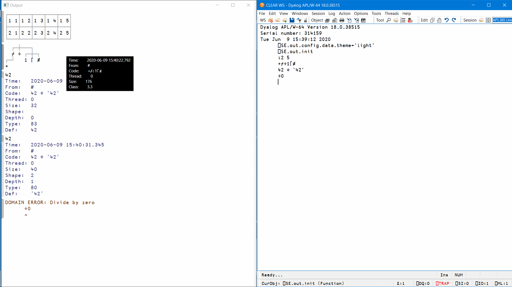

# Split session input and output
### *and give access to meta-data of output and errors*

## Installation

Requires Dyalog APL 18.0 or newer.

1. Clone to
  * `Documents\Dyalog APL Files\StartupSession\out` if on Windows
  * `$HOME/dyalog.files/StartupSession/out` everywhere else
2. Start APL
3. Run `⎕SE.out.init`  to start

You may want to run `⎕SE.out.init`  from a startup script.

* Run `⎕SE.out.stop` to revert to normal session
* Edit `config.apln`  to change settings

## Functionality

* Hover mouse over output to see meta-info for a given output or error
* Ctrl+click to toggle visibility of the meta-info below the output or error (for copying)
* Alt+click to remove an output from the log
* Ctrl+Alt+click or to remove all output
* `⎕SE.out.cls` to reset display (e.g. if settings have changed)
